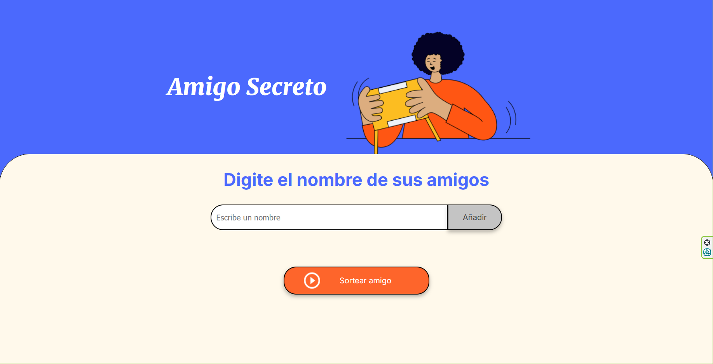
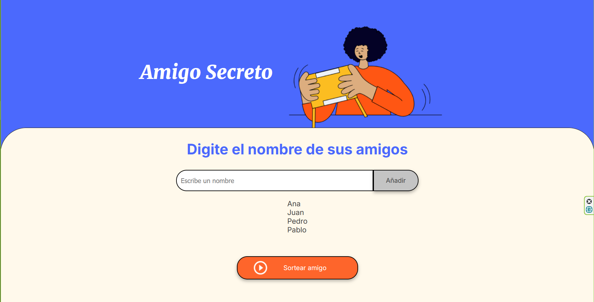
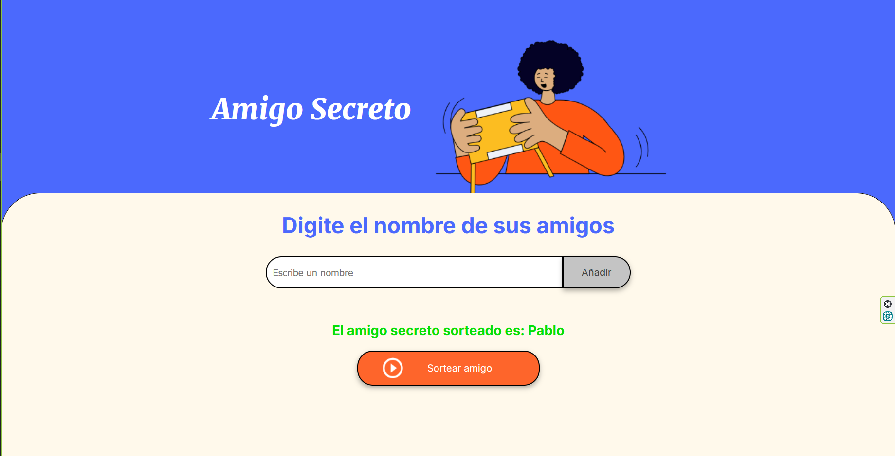

# Amigo Secreto

Este proyecto es una aplicación web simple para organizar y realizar un sorteo de "Amigo Secreto". Permite agregar nombres de participantes, mostrarlos en una lista y luego seleccionar aleatoriamente a un participante como ganador del sorteo.

---

## Tecnologías utilizadas

- **HTML5:** Estructura del contenido de la página.
- **CSS3:** Estilización de la aplicación (se espera que se utilice un archivo `style.css`).
- **JavaScript:** Lógica del funcionamiento del sorteo y manipulación dinámica del DOM.

---

## Características principales

1. **Agregar participantes:**
   - Los nombres ingresados se añaden a una lista visual.
   - La lista se actualiza dinámicamente cada vez que se añade un nuevo participante.

2. **Mostrar participantes en una lista:**
   - Cada participante aparece como un elemento en la lista ordenada.

3. **Sorteo aleatorio:**
   - Un botón permite seleccionar un nombre al azar de la lista.
   - Tras el sorteo, se vacía la lista y muestra el nombre sorteado.

4. **Interfaz accesible:**
   - Uso de atributos como `aria-label` y `aria-live` para mejorar la accesibilidad.

---

## Estructura del proyecto

```
AmigoSecreto/
├── index.html       # Archivo principal con la estructura del sitio
├── style.css        # Estilos personalizados
├── app.js           # Lógica de la aplicación
├── assets/          # Recursos como imágenes e íconos
└── README.md        # Documentación del proyecto
```

---

## Cómo usar este proyecto

1. **Clonar el repositorio:**
   ```bash
   git clone https://github.com/Erick-lp/Oracle-js
   ```

2. **Abrir el archivo HTML:**
   - Navega hasta la carpeta del proyecto.
   - Abre el archivo `index.html` en tu navegador.

3. **Interacción:**
   - Ingresa nombres en el campo de texto y haz clic en "Añadir".
   - Visualiza los nombres en la lista.
   - Haz clic en el botón "Sortear amigo" para seleccionar un nombre al azar.

---

## Vista previa

### Pantalla principal



### Ejemplo de lista de amigos



### Resultado del sorteo



---

## Personalización

1. **Estilo:**
   - Modifica `style.css` para personalizar los colores, tipografías y diseño general.

2. **Lógica del sorteo:**
   - Puedes ajustar `app.js` para agregar más funciones, como validar nombres duplicados o guardar los resultados del sorteo.

3. **Imágenes:**
   - Reemplaza los íconos e imágenes en la carpeta `assets` para adaptarlos a tu estilo.

---
